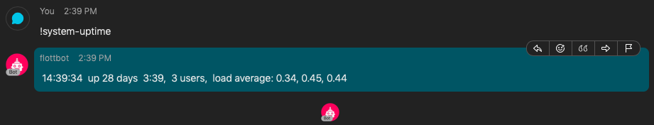

# flottbot

A Haskell based bot for Cisco Webex Teams.

Screen shot:



Currently doesn't support any security for external commands but will run things found in `commands` that have a valid `index.yaml`.


## TODO

1. Upstream webex-teams-api changes
1. HMAC secret decoding
1. Support TLS in `warp`
1. Include non-external process commands (!help, !commands, etc)
1. Dynamic reloading of config (via inotify)
1. Dynamic reloading of command indexes (likely !reload-commands, maybe via inotify)
1. Graceful shutdown (see https://gist.github.com/NathanHowell/5435345)
1. Turn `LoggingContext` into a monad transformer and merge with `App`
1. Less nesting in `handleMsg`
1. Better replying to user things failed (currently logged)
1. Turn log output into something more useful (currently `show a` on all `LogEvent`s)
1. Testing

## Getting Started

These instructions will get you a copy of the project up and running on your local machine for development and testing purposes. See deployment for notes on how to deploy the project on a live system.

### Prerequisites

What things you need to install the software and how to install them

1. Cisco Webex Teams account
2. open TCP port on the internet so the Webex API can contact it
3. `stack`

### Installing

A step by step series of examples that tell you how to get a development env running

1. Create a webhook

https://developer.webex.com/docs/api/v1/webhooks/create-a-webhook

2. Create a config file, `flottbot.yaml` (can override with `-c` to `flottbot`)

```yaml
---
loggingEnabled: true
loggingQueueSize: 10000

commandTimeoutInSeconds: 30

webexWebhookListen: 0.0.0.0
webexWebhookPort: 3000
webexWebhookEventWorkerCount: 4
webexWebhookEventWorkerQueueSize: 10000

webexAccessToken: <available once you have an account and create a bot, don't share this>
webexWebhookId: <in response from create webhook api call>
webexBotId: <available once you have an account and create a bot>
webexBotName: flottbot
webexBotUserName: flottbot
```

3. Run

```sh
$ flottbot -c flottbot.yaml
```


## Running the tests

TODO

### Break down into end to end tests

TODO

### And coding style tests

TODO

## Deployment

TODO

## Built With

* [Servant](http://docs.servant.dev/) - The web framework used
* And a host of other great Haskell libraries (see `package.yaml`)

## Contributing

Open a PR.

## Versioning

We use [SemVer](http://semver.org/) for versioning. For the versions available, see the [tags on this repository](https://github.com/your/project/tags).

## Authors

* **Adam Flott** - *Initial work* - [adamflott](https://github.com/adamflott)

See also the list of [contributors](https://github.com/your/project/contributors) who participated in this project.

## License

This project is licensed under the MIT License - see the [LICENSE.md](LICENSE.md) file for details

## Acknowledgments

* Wouldn't have bothered if https://hackage.haskell.org/package/webex-teams-api didn't exist
